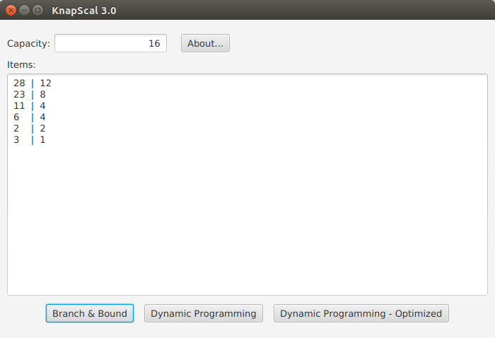
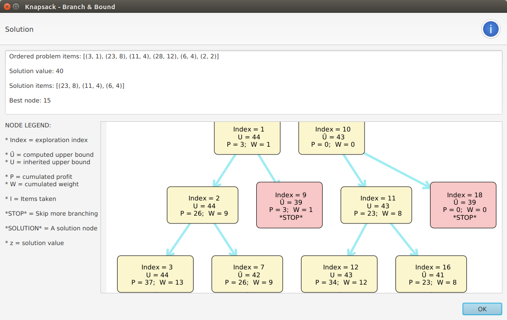
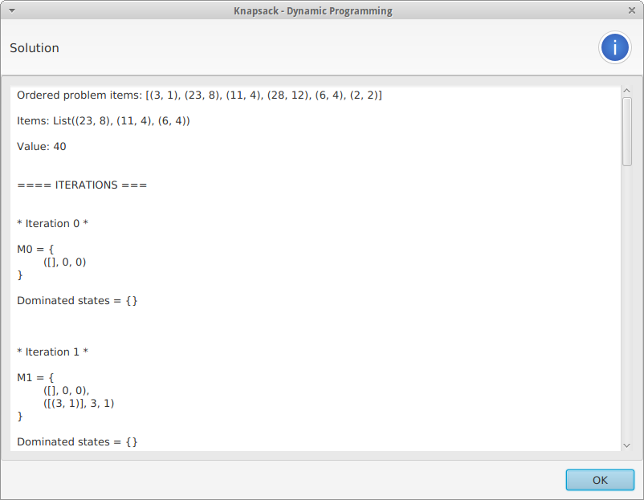
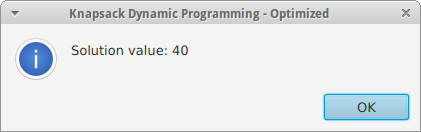

# KnapScal

*ScalaFX didactic application for the Knapsack problem*

## Introduction

KnapScal is a didactic ScalaFX application dedicated to the [Knapsack problem](https://en.wikipedia.org/wiki/Knapsack_problem).

It can solve an instance of the problem by employing different techniques:

* **KP01 Branch & Bound** - with a few standard functions for computing the upper bound of nodes. In particular:

  * *Dantzig*
  * *Optimized Dantzig*
  * *Martello-Toth*

* **KP01 Dynamic Programming** - keeping track of both active and dominated states

* **Optimized Dynamic programming** - using recursive functions to compute just the value of the solution

As shown in the screenshots below, the latest version of the application employs the [EighthBridge](https://github.com/giancosta86/EighthBridge) library to actually *render the Knapsack tree* in a Branch & Bound solution!

## Requirements

KnapScal requires Java 8 Update 65 or later compatible version.

## Running KnapScal

The suggested way to run KnapScal is [MoonDeploy](https://github.com/giancosta86/moondeploy), as it will automatically download and launch the application - just go to the [latest release](https://github.com/giancosta86/KnapScal/releases/latest) page and open the file **App.moondeploy**.

Otherwise, to start the application:
1. Download and decompress the zip archive
2. Run the file *bin/KnapScal* (on UNIX) or *bin/KnapScal.bat* (on Windows)

**Users already having KnapScal can just run the program: MoonDeploy will automatically update it to KnapScal 2**

## Branch & Bound solution

KnapScal now renders the Branch & Bound solution as a tree, just as expected.

### Zooming and panning

* To **zoom in/out**, use *the mouse wheel*

* To **pan**, press *CTRL* and, *while keeping it pressed*, drag any point of the drawing

### Laying out the nodes

The algorithm laying out the nodes is approximate - which might result in overlapping nodes.

Consequently, when solving a Knapsack problem via Branch & Bound, the application asks for 2 rendering parameters:

* **Estimated node width** - affecting horizontal positioning

* **Estimated node height** - affecting vertical positioning

Sensible default values are provided; however, should you notice overlapping nodes, you can:

* Drag & drop the nodes in the tree itself, to reposition them

* Re-run the algorithm, increasing the estimated node size

## Employing the kernel

[KnapScal-core](https://github.com/giancosta86/KnapScal-core), the underlying library, can be used in other applications for the JVM.

## Screenshots

## Further references

* [EighthBridge](https://github.com/giancosta86/EighthBridge) - Interactive graph modeling and rendering for ScalaFX

* [KnapScal-core](https://github.com/giancosta86/KnapScal-core) - Scala library for the Knapsack problem

* [Professor Silvano Martello - Didactic slides](http://www.or.deis.unibo.it/staff_pages/martello/Slides_LM_new.html)
